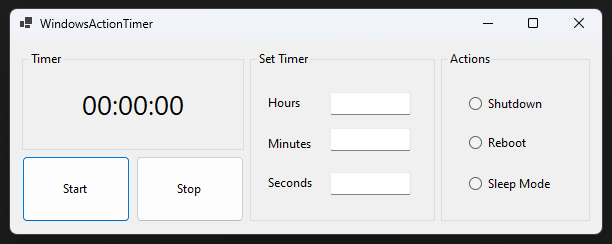

# WindowsActionTimer



WindowsActionTimer is a simple Windows Forms application that allows users to automatically execute specific actions on their computer once a timer runs out. These actions include shutting down, restarting, or putting the computer into sleep mode.

## Features

- **Timer Settings:**  
  - Users can set hours, minutes, and seconds for the timer.  
  - Empty input fields are automatically filled with `0`.

- **Actions:**  
  - Automatically shut down the computer.  
  - Automatically restart the computer.  
  - Automatically put the computer into sleep mode.

- **User-Friendly Interface:**  
  - Easy-to-use Start/Stop buttons.  
  - Timer display in the `hh:mm:ss` format.

## Technologies

- **Programming Language:** C#
- **Framework:** .NET Framework (Windows Forms)
- **Development Environment:** Visual Studio 2022

## Installation

1. Clone the repository:

   ```bash
   git clone https://github.com/venu21-dev/WindowsActionTimer.git
